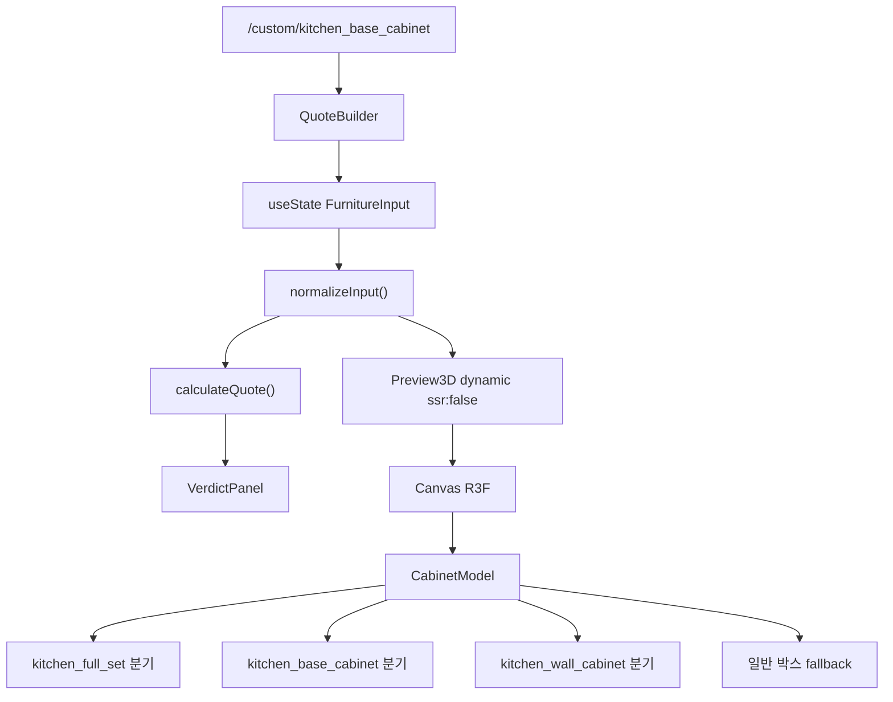

# 3D 미리보기 구현 상세 문서

> **목적**: 다른 AI에게 3D 미리보기 개선을 요청할 때 그대로 붙여넣을 수 있는 기술 레퍼런스  
> **프로젝트**: `custom-furniture-platform` (Next.js App Router + TypeScript)  
> **최종 반영 기준**: 2026-06-22 코드베이스 기준

---

## 1. 한 줄 요약

사용자는 `/custom/[productSlug]` 페이지에서 **QuoteBuilder → Preview3D**로 실시간 3D 미리보기를 본다.  
입력 상태는 `FurnitureInput` 하나로 관리되며, **견적(`lib/quote.ts`)과 3D(`components/Preview3D.tsx`)가 같은 input을 공유**하지만, **3D는 견적 BOM과 1:1로 일치하지 않는다** (특히 주방 설비·걸레받이·상판).

**3D 미리보기 진입점은 현재 QuoteBuilder 한 곳뿐**이다. (`Preview2D.tsx`는 미사용)

---

## 2. 관련 파일 맵

| 파일 | 역할 |
|------|------|
| `app/custom/[productSlug]/page.tsx` | 라우트. `QuoteBuilder` 마운트 |
| `components/QuoteBuilder.tsx` | UI·옵션·견적. `Preview3D` dynamic import |
| `components/Preview3D.tsx` | **3D 렌더링 핵심** (~1200줄, R3F Canvas) |
| `components/VerdictPanel.tsx` | 견적 판정 배지 (3D와 무관, quote 연동) |
| `components/ProductArt.tsx` | 카탈로그 **2D SVG** 썸네일 (3D와 별개) |
| `lib/types.ts` | `FurnitureInput`, `ProductType` |
| `lib/data.ts` | 상품 템플릿, `defaultInput` |
| `lib/kitchen.ts` | 주방 템플릿·옵션 ID·모듈 정규화 |
| `lib/platformConfig.ts` | `KITCHEN_STANDARDS` (SPS-KHFC 850/800/600/340) |
| `lib/quote.ts` | 견적·BOM·`verdictResult` (3D 미반영 부분 있음) |
| `lib/rules.ts` | 문짝 수 제한 등 |
| `lib/interior/validatePreview.ts` | 5단계 검증 파이프라인 (API용, 3D 비연동) |
| `app/api/v1/preview/route.ts` | JSON 검증·BOM 요약 API (3D 렌더 없음) |

### npm 의존성

```json
"three": "^0.184.0"
"@react-three/fiber": "^9.6.1"
"@react-three/drei": "^10.7.7"
```

---

## 3. 데이터 흐름



### QuoteBuilder → Preview3D props

```tsx
<Preview3D
  variant="hero"
  input={input}
  onInputChange={(next) => setInput(normalizeInput(next))}
/>
```

- `onInputChange`가 있을 때만 **주방 세트 모듈 드래그/추가/삭제** UI 활성화
- `variant="hero"`: 카드 헤더·문짝 디자인 셀렉트 숨김, 큰 Canvas

### SSR 처리

```tsx
const Preview3D = dynamic(() => import("@/components/Preview3D").then(m => m.Preview3D), {
  ssr: false,
  loading: () => <div>3D 미리보기 준비 중…</div>,
});
```

- WebGL Canvas는 클라이언트 전용
- 과거 `Environment preset="apartment"` HDR 원격 로드로 **로딩 멈춤** 이슈 → **제거**, `hemisphereLight` 사용

---

## 4. FurnitureInput (3D에 영향 주는 필드)

`lib/types.ts`

| 필드 | 3D 영향 |
|------|---------|
| `productType` | **렌더 분기 최상위** |
| `width_mm`, `height_mm`, `depth_mm` | 치수 |
| `material`, `color` | `getMaterialPreset()` → 색상 |
| `has_door`, `door_count` | 문짝 개수 |
| `shelf_count` | 선반 (일반 박스·SimpleCabinet) |
| `handle_type` | `"무손잡이"`면 손잡이 숨김 |
| `countertop_type` | `none`이면 상판·싱크·수전·쿡탑 3D 숨김 |
| `toe_kick_option` | `none` \| `standard_100` — 걸레받이 패널·본체 들뜸 |
| `sink_option`, `faucet_option` | 상판 있을 때만 3D |
| `hood_option`, `cooktop_option`, `microwave_option` | 세트 전용 Trim 메시 |
| `kitchen_template` | 세트 템플릿 ID |
| `kitchen_modules_mm[]` | 모듈 폭 배열 (mm) |
| `kitchen_module_types[]` | `door \| drawer \| pullout \| open` |
| `sink_module_index` 등 | 설비 X 위치 (모듈 인덱스) |
| `drawer_module_count` | 하부장 단품: 서랍형 vs 도어형 |

**3D 전용 state (FurnitureInput 밖, Preview3D 내부)**

| state | 기본값 | 설명 |
|-------|--------|------|
| `doorStyle` | `"flat"` | `flat \| frame \| slat` — UI는 non-hero에서만 |
| `freeView` | **`true`** | 자유 Orbit vs 정면 Orthographic |
| `selectedModuleIndex` | `0` | 세트 편집용 |
| `activeDragTarget` | `null` | 모듈/설비 드래그 |

---

## 5. 상품별 3D 렌더 분기 (`CabinetModel`)

`components/Preview3D.tsx` → `CabinetModel()` 함수

### 5.1 `kitchen_full_set` (싱크대 상하부장 세트)

**전용 경로.** 하부 N개 + 상부 N개 + 옵션 설비.

| 요소 | 구현 |
|------|------|
| 하부장 | `KitchenBaseModule` × 모듈 수 |
| 상부장 | `KitchenWallModule` × 모듈 수, `y = 1.3m` |
| 상판 | `countertop_type !== "none"` 일 때 `Trim` |
| 싱크/쿡탑/수전 | **상판 있을 때만** |
| 후드 | 상부장 앞 `Trim` (상판 무관) |
| 전자레인지 | `Trim` 박스 |
| 모듈 편집 | 드래그로 위치 변경, `+` 버튼으로 모듈 추가 |

**모듈 X 좌표**: `getModuleCenterX(modulesMm, index)` — 좌측 정렬, mm→m

**템플릿** (`lib/kitchen.ts`):

| ID | 폭 | 모듈 |
|----|-----|------|
| `kitchen_1800_basic` | 1800 | 600×3 |
| `kitchen_2400_standard` | 2400 | 600×4 |
| `kitchen_3000_family` | 3000 | 600×5 |

### 5.2 `kitchen_base_cabinet` (싱크대 하부장 단품)

**전용 경로** (2026-06 추가).

| 요소 | 조건 |
|------|------|
| `KitchenBaseModule` 1개 | 항상 |
| 조절 다리 4개 | **항상** (`KitchenLegsAndToeKick`) |
| 걸레받이 패널 | `toe_kick_option === "standard_100"` |
| 본체 Y offset | 걸레받이 있으면 +100mm |
| 상판/싱크/수전 | 상판 옵션 선택 시 |
| 모듈 타입 | `drawer_module_count > 0` → 서랍 라인 Trim |
| `interactive` | `false` (선택 mesh 없음) |

기본 치수: 900×**850**×**600** (`KITCHEN_STANDARDS`)

### 5.3 `kitchen_wall_cabinet` (싱크대 상부장 단품)

**전용 경로.**

| 요소 | 설명 |
|------|------|
| `KitchenWallModule` | 얕은 깊이(340mm), **하단 손잡이** `WallHandle` |
| 바닥 힌트 | 얇은 `Trim` (벽면 느낌) |
| Y 위치 | **바닥(y=0)** — 벽 설치 높이(1300mm) 미표현 |

기본: 900×**800**×**340**

### 5.4 그 외 (`custom_shelf`, `gap_cabinet`, `shoe_cabinet`, `built_in_wardrobe`)

**일반 박스 fallback** (453~731행 근처).

- 5면 `Panel` + `Doors` + `WoodGrain`(목재 계열)
- `position={[0, -(h*scale)/2, 0]}` — 바닥 정렬
- `PerspectiveCamera` + `OrbitControls` (주방 아님)
- 문짝 손잡이: 측면 `Handle` (상부장과 다름)

---

## 6. 3D 프리미티브 컴포넌트

모두 `Preview3D.tsx` 내부 private 함수.

| 컴포넌트 | 설명 |
|----------|------|
| `Panel` | `boxGeometry` + `meshStandardMaterial` + `Edges` |
| `Trim` | 금속/상판/다리용 단순 box |
| `Doors` | N개 문짝 + frame/slat + **측면** Handle |
| `SimpleCabinet` | 5면 + 선반 + Doors (하부장 본체) |
| `KitchenBaseModule` | SimpleCabinet + 서랍/레일 Trim + 다리/걸레받이 + (선택) hit mesh |
| `KitchenWallModule` | 얕은 박스 + `WallDoor` |
| `WallDoor` | 단일 문 + **하단** WallHandle |
| `KitchenLegsAndToeKick` | 4다리 + (옵션) 걸레받이 전면 패널 |
| `DoorFrame`, `DoorSlats`, `WoodGrain` | 장식 |

### 재질 프리셋 (`materialPresets`)

`input.material` 문자열 → `getMaterialPreset()`:

| 키워드 | preset |
|--------|--------|
| 오크 | `oak_pb` |
| PET | `matte_white_pet` |
| MDF | `natural_mdf` |
| 합판/자작/월넛 | plywood 계열 |
| 기본 | `white_pb` |

**한계**: 실제 `materials` 카탈로그(`lib/catalogData.ts`)와 1:1 매핑 아님. 문자열 includes 매칭.

---

## 7. 주방 3D 상수 (미터 단위)

`Preview3D.tsx` + `lib/platformConfig.ts` (`KITCHEN_STANDARDS`)

| 상수 | 값 | 출처 |
|------|-----|------|
| `KITCHEN_BASE_HEIGHT_M` | 0.85 | SPS-KHFC 하부 우선 850mm |
| `KITCHEN_BASE_DEPTH_M` | 0.60 | 하부 깊이 600mm |
| `KITCHEN_WALL_HEIGHT_M` | 0.80 | 상부 800mm |
| `KITCHEN_WALL_DEPTH_M` | 0.34 | 상부 깊이 340mm |
| `KITCHEN_WALL_BOTTOM_M` | 1.30 | 상부장 하단 (바닥 기준) |
| `KITCHEN_TOE_KICK_M` | 0.10 | 걸레받이 100mm |
| `KITCHEN_COUNTERTOP_M` | 0.045 | 상판 두께 |

### Scene frame (카메라 fit)

| 함수 | 용도 |
|------|------|
| `getKitchenSceneFrame(widthMm)` | 세트 전체 높이 (상부까지) |
| `getSingleBaseFrame(widthMm, hasToeKick)` | 하부장 단품 |
| `getSingleWallFrame(widthMm)` | 상부장 단품 |

`modelScale = min(1, 1.55~1.65 / totalWidthM)` — 넓은 주방이 화면에 들어오게 축소

---

## 8. 카메라·조작

### 주방 3종 (`isKitchenProduct`)

| `freeView` | 카메라 | OrbitControls | 그룹 rotation |
|------------|--------|---------------|---------------|
| `true` (기본) | `PerspectiveCamera` + `KitchenPerspectiveFit` | ✅ | `-0.22` rad (단품) / `-0.38` (세트, lockFrontView false) |
| `false` | `OrthographicCamera` + `KitchenFrontCamera` | ❌ | `0` (정면) |

UI: 우상단 **「자유 시점 / 정면 고정」** 토글

### 비주방

- `PerspectiveCamera` 고정 `[1.8, 1.3, 2.1]`
- `OrbitControls` 항상

### 주방 세트 드래그 (편집)

- `sceneRef` DOM rect 기준 pointer X → `dragRatio` 0~1
- `getModuleIndexFromRatio` → 모듈 인덱스
- `moveKitchenModule` / `moveKitchenItem` → `onInputChange` → `normalizeInput`
- **useEffect deps에 `kitchenLayout` 포함** → 매 렌더 새 객체로 불필요 재구독 가능

---

## 9. QuoteBuilder 옵션 ↔ 3D 매핑

### UI 구조

1. **히어로**: Preview3D
2. **소재 칩**: `material` / `color`
3. **기본 규격** (세트만): 템플릿 버튼
4. **상세 옵션** (접기): 사이즈·주방 설비·문짝
5. **하단 고정**: 견적 + `VerdictPanel`

### 주방 옵션 ID (`lib/kitchen.ts`)

**상판** `countertopOptions`:

- `none`, `pt_white`, `engineered_stone`, `stainless`

**걸레받이** `toeKickOptions`:

- `none`, `standard_100`

**싱크** `sinkOptions`: `none`, `single_780`, `single_860`, `double_900`

**수전** `faucetOptions`: `none`, `basic_cobra`, `pullout`, `black_pullout`

**후드/쿡탑/전자레인지**: 세트 상세 옵션에만 UI

### 기본값 (`getInitialInput`)

| productType | countertop | toe_kick | sink |
|-------------|------------|----------|------|
| `kitchen_base_cabinet` | none | none | none |
| `kitchen_full_set` | none | none | none |

`normalizeInput`에서 주방은 위 기본값 강제 (`?? "none"`).

---

## 10. 견적 vs 3D 불일치 (개선 시 중요)

| 항목 | 견적 (`lib/quote.ts`) | 3D |
|------|----------------------|-----|
| 걸레받이 BOM | `toe_kick_option` 반영 | 동일 옵션 반영 |
| 상판 BOM | `countertop quantity 0/1` | 동일 |
| 싱크볼 치수 | 고정 780 등 | **고정 Trim 크기** (마스터 DB 미연동) |
| 하부장 단품 | `bodyParts` + 걸레받이 | `KitchenBaseModule` |
| 상부장 단품 | 벽고정 보강 BOM | 벽고정 표현 없음 |
| 문짝 디자인 | 미반영 | `doorStyle` 로컬 state only |
| SPS-KHFC 검증 | `verdictResult` | **3D에 verdict 미표시** (QuoteBuilder 하단만) |
| 엣지/재단 | BOM 상세 | **미표현** |

---

## 11. 2D vs 3D

| | ProductArt (SVG) | Preview3D |
|--|------------------|-----------|
| 위치 | 홈 카탈로그 썸네일 | QuoteBuilder |
| 하부장 | 상판+본체+다리 느낌 | 옵션형 상판/걸레받i |
| 연동 | **없음** | FurnitureInput |

---

## 12. API 미리보기 (3D 아님)

`POST /api/v1/preview`

- Body: `{ project_type, input, room_measurement?, plant_id?, appliances? }`
- Response: `verdict`, `issues`, `pipeline_stages`, `bom_lines`, `cut_plan`
- **WebGL 렌더 없음** — 검증·견적 숫자용

---

## 13. 라우트·URL

| URL | productType |
|-----|-------------|
| `/custom/kitchen_base_cabinet` | 하부장 |
| `/custom/kitchen_wall_cabinet` | 상부장 |
| `/custom/kitchen_full_set` | 세트 |
| `/custom/built_in_wardrobe` | 붙박이장 |
| `/custom/custom_shelf` | 선반 |
| … | `lib/data.ts` productTemplates |

`app/custom/page.tsx` → `/` redirect

---

## 14. 알려진 한계·버그 후보 (AI 개선 요청용)

### P0 — 사용자 체감

1. **상부장 단품**이 바닥(y=0)에 놓여 벽장 느낌 약함 → 1300mm 벽면 컨텍스트 또는 반쪽 주방 씬 필요
2. **싱크볼/상판 3D**가 실제 제품 스펙(`lib/interior/masters/sinkBowls.ts`)과 무관한 고정 박스
3. **doorStyle**이 견적/저장 input에 없어 새로고침 시 초기화
4. **freeView=true일 때 세트** rotation `-0.38` vs 단품 `-0.22` — 시각 일관성 부족
5. **ErrorBoundary 없음** — WebGL 실패 시 빈 Canvas

### P1 — 주방 realism

6. 상판 선택 시 **엣지 후면**·**코너 라운드** 없음
7. **걸레받i 없을 때** 다리만 30mm — SPS 조절범위(15mm+) 시각화 미흡
8. **후드/전자레인지** 위치 Y 하드코딩 (`1.58`, `upperBottomY - 0.08`)
9. **모듈 타입 pullout/open** 3D 차별화 약함
10. **싱크장 전용** 하부장(볼류·배수 컷아웃) 미구현

### P2 — 아키텍처

11. Preview3D **1200줄 단일 파일** — kitchen / camera / primitives 분리 필요
12. `kitchenLayout` **useMemo 미사용** → drag effect churn
13. `getCountertopOption` fallback이 `none`이지만 다른 getter는 여전히 `[1]` fallback (`getSinkOption` 등)
14. **MultiOrderBuilder**에 Preview3D 없음
15. **모바일** touch drag vs OrbitControls 제스처 충돌 가능

### P3 — 기준서 정합

16. SPS-KHFC **상부장 깊이 300~350** — 단일 340만 사용
17. **REHAU 엣지**·**가전 개구부** 3D 없음
18. **실측 room_measurement** UI 없어 검증만 API 가능

---

## 15. AI에게 줄 개선 요청 템플릿

```markdown
## 목표
[예: 싱크대 하부장 3D를 한샘/백조씽크 카탈로그 수준으로]

## 현재 구조
- 진입: QuoteBuilder → Preview3D (ssr:false)
- 분기: CabinetModel productType switch
- 입력: FurnitureInput (docs/PREVIEW_3D_IMPLEMENTATION.md 참고)

## 변경 허용 파일
- components/Preview3D.tsx
- components/QuoteBuilder.tsx
- lib/kitchen.ts
- lib/types.ts

## 반드시 지킬 규칙
- 상판/걸레받i/싱크는 option id "none"이면 3D·BOM 모두 제외
- 기본 카메라: freeView=true (OrbitControls)
- SPS-KHFC: 하부 850×600, 상부 800×340, 상부 하단 1300

## 완료 기준
- [ ] /custom/kitchen_base_cabinet 에서 ...
- [ ] 옵션 토글 시 3D 즉시 반영
- [ ] npm run build 통과
```

---

## 16. 로컬 테스트

```bash
npm run dev -- -p 3000

# 페이지
open http://localhost:3000/custom/kitchen_base_cabinet
open http://localhost:3000/custom/kitchen_full_set

# 검증 API (3D 무관)
curl -s -X POST http://localhost:3000/api/v1/preview \
  -H 'Content-Type: application/json' \
  -d '{"project_type":"kitchen","input":{...}}'
```

** hung process 주의**: 3000 포트 `next-server`가 응답 없으면 `kill $(lsof -t -i:3000)` 후 재시작

---

## 17. 코드 앵커 (빠른 탐색)

| 관심사 | 파일:대략적 위치 |
|--------|------------------|
| Canvas·카메라 | `Preview3D.tsx` 322~385 |
| freeView state | `Preview3D.tsx` 103 |
| CabinetModel 분기 | `Preview3D.tsx` 481~685 |
| KitchenBaseModule | `Preview3D.tsx` 929~ |
| getInitialInput | `QuoteBuilder.tsx` 331~ |
| normalizeInput | `QuoteBuilder.tsx` 396~ |
| 주방 옵션 목록 | `lib/kitchen.ts` 79~ |
| KITCHEN_STANDARDS | `lib/platformConfig.ts` 20~ |

---

## 18. 관련 문서

- `docs/PREVIEW_AND_SITE_STRUCTURE.md` — **일부 outdated** (하부장=일반박스 등). 이 문서가 3D 최신 기준.
- `docs/rules/validation-engine.md` — 검증 파이프라인 (3D 별도)
- `docs/GAP_ANALYSIS.md` — 전체 갭

---

*이 문서는 `components/Preview3D.tsx` 및 `components/QuoteBuilder.tsx` 소스를 기준으로 작성되었습니다.*
